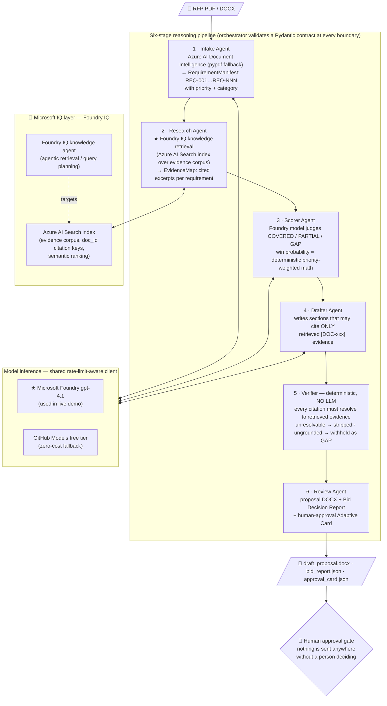

# RFP Intelligence Agent

A six-stage reasoning pipeline that turns a raw RFP PDF into a citation-grounded draft proposal — where **every claim must point at the exact internal document it came from, or it doesn't ship**.

**Microsoft Agents League @ AI Skills Fest 2026 — 🧠 Reasoning Agents track · Microsoft IQ layer: Foundry IQ**

## The Problem

Sales and BD teams spend 3–5 days on every RFP response, and win rates sit at 20–30% because proposals are generic. The relevant internal knowledge — past case studies, certifications, pricing schedules, reference projects — is scattered across the organisation with no fast way to retrieve it, apply it, and *prove* it supports each claim. Worse, an LLM drafting a proposal unsupervised will happily invent capabilities the company doesn't have. A hallucinated claim in a signed government tender isn't an oops — it's a contract breach.

## The Solution

A pipeline that treats **grounding as the product**: multi-step reasoning extracts and scores requirements, retrieval supplies evidence with citation keys, and a deterministic verifier guarantees nothing un-evidenced survives to the final document.



### Why this is a *reasoning* agent, not a wrapper

- **Multi-step decomposition** — an 8-page RFP becomes 40+ atomic requirements, each independently researched, scored, and drafted.
- **Judgement is separated from arithmetic** — the model judges evidence sufficiency per requirement; the win probability is deterministic priority-weighted math in code. The model never picks the final number and never decides whether to bid.
- **Adversarial self-checking** — the Verifier (stage 5) is deliberately not an LLM: citation verification is a trust mechanism, and running it through a model would reintroduce the failure mode it exists to catch.
- **A first-class reasoning trace** — the Bid Decision Report records the full decision chain per requirement (evidence considered → score + confidence → citation verification outcome → action required), streamed to the console, appended to the DOCX, and saved as JSON.

## Live run results (June 14, 2026 — fully on Microsoft Foundry, not stubbed)

Reasoning model: **Microsoft Foundry gpt-4.1** · Retrieval: **Foundry IQ** (Azure AI Search):

| Metric | Result |
|---|---|
| Requirements extracted from 8-page sample RFP | 68 |
| Scored | 6 COVERED · 18 PARTIAL · 44 GAP |
| Priority-weighted win probability | 25% |
| Citations verified by stage 5 | **51/51, 0 stripped** |
| Recommendation | REVIEW BID DECISION (deterministic band) |
| Pipeline status | `complete`, 0 errors |

The gaps are the system working as designed: requirements the evidence corpus genuinely doesn't cover (insurance schedules, timeline commitments, tender boilerplate) are flagged for human action instead of being papered over with confident prose. **Every one of the 51 citations the drafter produced resolved to a real retrieved document** — nothing ungrounded reached the proposal.

## Microsoft technologies used

| Service | Role |
|---|---|
| **Microsoft Foundry** (gpt-4.1) | Model inference for every reasoning stage — `MODEL_PROVIDER=foundry` |
| **Foundry IQ** (Azure AI Search) | Knowledge retrieval over the evidence corpus with citation keys — the Microsoft IQ layer |
| **GitHub Models** | Zero-cost inference fallback for environments without Foundry model quota |
| **Azure AI Document Intelligence** | RFP parsing, `prebuilt-layout` (pypdf fallback when no resource available) |
| **Adaptive Cards** | Human-in-the-loop approval artifact (Teams delivery is roadmap) |
| **GitHub Copilot / AI-assisted development** | Used throughout development |

## Engineering notes — running on a $0 budget

This project was built and demoed on free Azure subscriptions (a free trial and Azure for Students), with **no pay-as-you-go upgrade** — agent demos shouldn't require an uncapped credit card. Two design choices made that possible, both visible in the code:

1. **Inference** — `tools/foundry_client.py` serves two providers behind one interface. The live demo runs on a **Microsoft Foundry gpt-4.1 deployment** (`MODEL_PROVIDER=foundry`); **GitHub Models** is a drop-in zero-cost fallback (`MODEL_PROVIDER=github_models`) for anyone without Foundry model quota. The client is rate-limit aware: proactive tokens-per-minute pacing, `Retry-After` backoff, JSON mode with schema-validated retries.
2. **Retrieval** — `scripts/setup_foundry_iq.py` builds the complete Foundry IQ stack: Azure AI Search index → corpus upload → knowledge agent. The agentic knowledge agent needs an Azure OpenAI deployment for query planning; where that quota isn't available the script skips it and the pipeline queries **the same index directly** (`RETRIEVAL_MODE=azure_search`, semantic ranking when the tier supports it, full-text otherwise). The full agentic client (`FoundryIQRetriever`) is implemented and ready. The live demo runs against a real Azure AI Search index built from this corpus.

## Run it yourself

```bash
git clone https://github.com/ratyagi/rfp-intelligence-agent.git
cd rfp-intelligence-agent
pip install -r requirements.txt
cp .env.example .env   # then fill in the variables for your chosen mode

# Zero-credential smoke run (stubbed inference, local BM25 retrieval)
STUB_MODE=true RETRIEVAL_MODE=local python -m agents.orchestrator demo/sample_rfp.pdf

# Live run on the GitHub Models free tier (PAT with Models:read)
#   .env: MODEL_PROVIDER=github_models, GITHUB_MODELS_TOKEN=..., STUB_MODE=false
python -m agents.orchestrator demo/sample_rfp.pdf

# Foundry IQ retrieval (after creating an Azure AI Search resource)
python scripts/setup_foundry_iq.py     # builds index + uploads corpus (+ agent if you have model quota)
#   .env: RETRIEVAL_MODE=azure_search  (or foundry_iq with model quota)

# Tests (47, no credentials needed)
STUB_MODE=true RETRIEVAL_MODE=local python -m pytest tests/ -q
```

Outputs land in `output/`: the proposal DOCX (with the Bid Decision Report appendix), the machine-readable bid report JSON, and the approval Adaptive Card JSON.

## Reliability & safety patterns

- Pydantic contracts validated at **every** stage boundary; schema-invalid model output is retried once with the validation error fed back, then handled fail-soft (skip chunk / score as GAP / withhold section).
- Deterministic citation verification — ungrounded text never reaches the output document.
- Human approval gate — the pipeline produces artifacts; it never sends, posts, or submits anything itself.
- Rate-limit-aware client so the pipeline degrades to *slower*, not *broken*, on throttled free tiers.
- No secrets in the repo (`.env` is gitignored); the corpus and sample RFP are fully synthetic.

## Repository map

```
agents/          orchestrator + the six stage implementations
tools/           model client, retrieval (3 backends), contracts, DOCX/report/card builders
prompts/         system prompts (input/output contracts per agent)
corpus/          synthetic evidence corpus (DOC-001…DOC-014, front-matter citation keys)
demo/            8-page sample RFP + demo script
scripts/         one-time Foundry IQ / Azure AI Search setup
tests/           47 tests, all runnable with zero credentials
docs/            ARCHITECTURE.md (locked decisions) + session notes
```

## Team

Rashi Tyagi ([@ratyagi](https://github.com/ratyagi))

## Demo video

[DEMO VIDEO — link to be added before submission]
